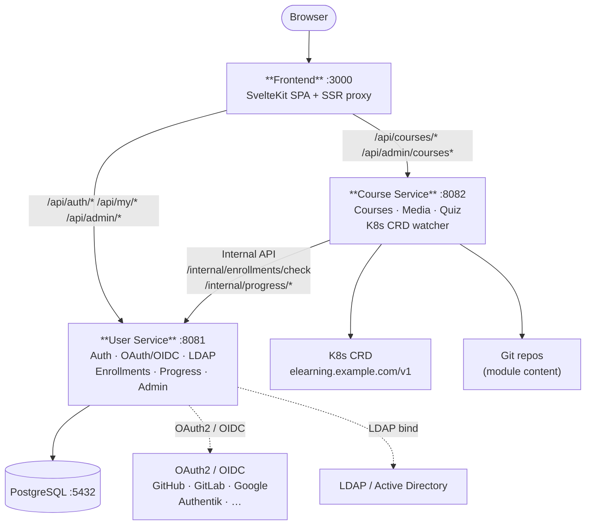

# E-Learning Platform

Micro-services platform for online courses with Kubernetes CRD-based course definitions.

## Architecture



| Service | Role | Tech |
|---------|------|------|
| **Course Service** | Course content, media serving, K8s CRD watcher, quiz scoring & cooldown | Go + chi + client-go |
| **User Service** | Auth (local · OAuth2/OIDC · LDAP), enrollments, group enrollment, progress, admin | Go + chi + pgx |
| **Frontend** | SvelteKit SPA, server-side API proxy | SvelteKit |

## Source of truth

Courses are defined as Kubernetes CRDs (`elearning.example.com/v1`, kind `Course`) — see [`docs/Course.md`](docs/Course.md) for the full spec including quiz and cooldown configuration.

## Quick start

```bash
make dev
```

See `CONTRIB.md` for the full step-by-step guide, troubleshooting, and deployment details.

## Project structure

```
./
├── course-service/       # Go service (port 8082)
│   ├── internal/
│   │   ├── content/      # Store, K8s watcher, git fetch, quiz types & scoring
│   │   ├── handlers/     # HTTP routes
│   │   ├── middleware/   # JWT auth
│   │   ├── config/       # Env config
│   │   └── metrics/      # Prometheus
│   └── examples/         # Sample k8s manifests
├── user-service/         # Go service (port 8081)
│   ├── internal/
│   │   ├── db/           # PG + migrations
│   │   ├── handlers/     # Auth, OAuth, LDAP, admin, progress
│   │   ├── middleware/   # JWT
│   │   └── config/       # Env config
│   └── migrations/       # SQL migrations (embed)
├── frontend/             # SvelteKit
├── helm/                 # Helm chart
├── docs/                 # Architecture, Course spec, SSO, Module reference
└── examples/
    ├── courses/          # Course CRD manifests (applied by make apply-courses)
    ├── k8s/              # Standalone K8s manifests (ConfigMaps, Deployments, Secrets)
    └── quizzes/          # Example quiz YAML files
```
