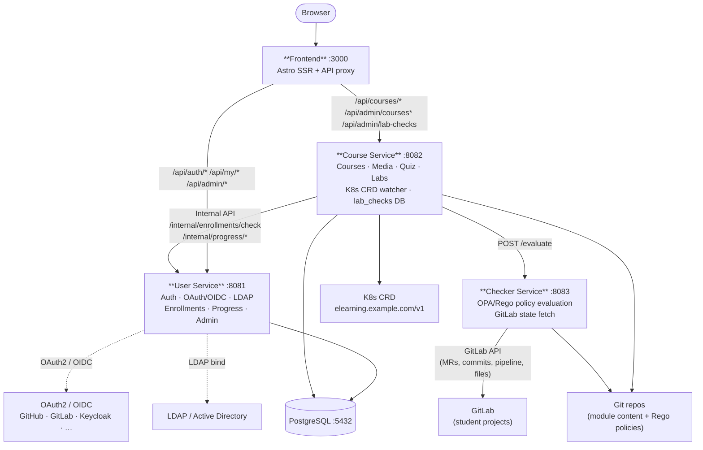

# E-Learning Platform

Micro-services e-learning platform with Kubernetes CRD-based course definitions and automated lab validation.

## Architecture



| Service | Role | Tech |
|---------|------|------|
| **Course Service** | Course content, media, quiz, inline lab rendering, checker proxy, lab_checks persistence | Go + chi + client-go + pgx |
| **User Service** | Auth (local · OAuth2/OIDC · LDAP), enrollments, progress, admin | Go + chi + pgx |
| **Checker Service** | Fetch live GitLab state, evaluate OPA/Rego policy, return violations | Go + chi + go-gitlab + OPA |
| **Frontend** | Astro SSR, API proxy, markdown lab rendering, admin Labs page | Astro |

## Source of truth

Courses are defined as **Kubernetes CRDs** (`elearning.example.com/v1`, kind `Course`). See [`docs/Course.md`](docs/Course.md) for the full spec.

## Interactive Labs — Lab Checker

Lab modules (`type: lab`) display the assignment inline (markdown) and let students validate their GitLab work via the **"Vérifier mon travail"** button.

Each lab requires two files co-located with `content.md` in the git repo:

```
modules/lab1/
  ├── content.md    # Assignment (markdown)
  ├── check.yaml    # Checker config: provider, project template, files to verify
  └── check.rego    # OPA/Rego policy: validation rules
```

Validation flow:
```
Student clicks "Vérifier"
  → course-service reads check.yaml + check.rego from git
  → POST checker-service /evaluate
  → checker fetches live GitLab state (MRs, commits, pipeline, files)
  → evaluates Rego → {allow, violations}
  → stored in DB (lab_checks)
  → result displayed to student
```

Instructors can review all attempts at `/admin/labs`.

See [`docs/interactive-labs.md`](docs/interactive-labs.md) for full documentation.

## Quick start

```bash
make dev
```

See `CONTRIB.md` for the full step-by-step guide, troubleshooting, and deployment details.

## Project structure

```
./
├── checker-service/      # Go service (port 8083)
│   └── internal/
│       ├── checker/      # GitLab fetch + Rego evaluation
│       ├── handlers/     # POST /evaluate
│       └── config/       # Env config
├── course-service/       # Go service (port 8082)
│   ├── internal/
│   │   ├── content/      # Store, K8s watcher, git fetch, quiz scoring
│   │   ├── db/           # PG connect + migrations
│   │   ├── handlers/     # HTTP routes + CheckModule + lab_results
│   │   ├── middleware/   # JWT auth
│   │   ├── config/       # Env config
│   │   └── metrics/      # Prometheus
│   └── migrations/       # Embedded SQL migrations
├── user-service/         # Go service (port 8081)
│   ├── internal/
│   │   ├── db/           # PG + migrations
│   │   ├── handlers/     # Auth, OAuth, admin, progress
│   │   ├── middleware/   # JWT
│   │   └── config/       # Env config
│   └── migrations/       # Embedded SQL migrations
├── frontend/             # Astro
├── helm/                 # Helm chart (all services)
├── infra/                # Kind config + manifests
├── docs/                 # Architecture, Course spec, Labs, SSO
└── examples/             # Sample Course CRD manifests
```

## Configuration

Each service is configured via a **ConfigMap mounted as a file** in the container. Environment variables coexist and override file values.

| Service | Mounted file | Key variables |
|---|---|---|
| **course-service** | `/etc/course-service/config.yaml` | `JWT_SECRET`, `DATABASE_URL`, `CHECKER_SERVICE_URL`, `GIT_TOKEN` |
| **user-service** | `/etc/user-service/config.yaml` | `JWT_SECRET`, `DATABASE_URL`, `OIDC_*` |
| **checker-service** | env only | `GITLAB_TOKEN`, `GITLAB_BASE_URL` |
| **frontend** | `/etc/frontend/config.env` | `COURSE_API`, `USER_API` |

## Git credentials — course-repo-secret

Courses with private git module repos require a K8s secret:

```bash
kubectl create secret generic course-repo-secret \
  --from-file=git-credentials.yaml=./git-credentials.yaml
```

`git-credentials.yaml` format:
```yaml
credentials:
  - url: "github.com/org/*"
    token: "ghp_xxx"
```

## Internal API

| Caller | Target | Endpoint | Description |
|---|---|---|---|
| Course Service | User Service | `GET /internal/enrollments/check` | Check enrollment |
| Course Service | User Service | `GET /internal/progress/viewed` | Get viewed lessons |
| Course Service | User Service | `POST /internal/progress/complete` | Mark lesson complete |
| Course Service | Checker Service | `POST /evaluate` | Evaluate lab submission |

## Known issue: Bitnami PostgreSQL

The Helm chart uses Bitnami PostgreSQL by default (`postgresql.enabled: true`), which may get stuck `Pending` on KinD due to `Insufficient ephemeral-storage`. If that happens, set `postgresql.enabled: false` in `infra/kind/kind-values.yaml` and run `make helm-install`.
